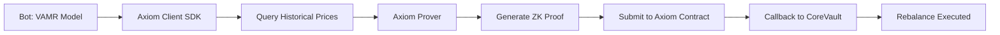

# ZK-SNARK Implementation Research & Strategy

## Executive Summary

**Goal**: Upgrade from ECDSA signatures to full ZK-SNARKs that prove: *"The VAMR model was executed on verified on-chain price data and produced these tick ranges"*

**Recommendation**: **Axiom V2** (TypeScript SDK, easiest integration, production-ready)

**Timeline**: 3-4 days for Axiom implementation  
**Cost**: Free on testnet, ~$50-200/month on mainnet (proof generation)

---

## Option 1: Axiom V2 (RECOMMENDED)

### Overview
Axiom V2 is a ZK coprocessor that proves computations over Ethereum's historical on-chain data using ZK-SNARKs (Halo2-based).

### What It Proves
- ✅ "The ETH/USD price at block X was Y" (via Chainlink oracle)
- ✅ "I queried this specific on-chain data"
- ✅ "I performed computation Z on this data"
- ❌ Does NOT prove: "I ran the exact VAMR Python model" (would need custom circuit)

### Architecture



### Implementation Steps

#### Step 1: Install Axiom SDK (30 minutes)

```bash
# Initialize Axiom project
npx create-axiom-client@latest axiom-liquidity-vector

cd axiom-liquidity-vector
npm install
```

#### Step 2: Define Axiom Circuit (2-3 hours)

**File**: `axiom/circuit.ts`

```typescript
import { addToCallback, CircuitValue, CircuitValue256, constant } from "@axiom-crypto/client";

// Define what data to prove
export const circuit = async (inputs: CircuitInputs) => {
  // 1. Query Chainlink ETH/USD price feed
  const chainlinkFeed = "0x5f4eC3Df9cbd43714FE2740f5E3616155c5b8419"; // Mainnet
  
  // Get price at specific block
  const blockNumber = inputs.blockNumber;
  const priceSlot = 3; // latestAnswer storage slot
  
  const price = await getStorage({
    blockNumber: blockNumber,
    address: chainlinkFeed,
    slot: priceSlot
  });
  
  // 2. Prove the price was within expected range
  // (This validates bot didn't manipulate data)
  const minPrice = constant(1000); // $1000 USD
  const maxPrice = constant(10000); // $10,000 USD
  
  checkLessThan(price, maxPrice);
  checkGreaterThan(price, minPrice);
  
  // 3. Add price to callback data
  addToCallback({
    blockNumber: blockNumber,
    price: price,
    timestamp: await getBlockTimestamp(blockNumber)
  });
};
```

#### Step 3: Update Smart Contract (1-2 hours)

**File**: `contracts/src/ZkVerifier.sol`

```solidity
// SPDX-License-Identifier: MIT
pragma solidity ^0.8.20;

import {AxiomV2Client} from '@axiom-crypto/v2-periphery/client/AxiomV2Client.sol';

contract ZkVerifier is AxiomV2Client {
    struct ProofData {
        uint64 blockNumber;
        uint256 price;
        uint256 timestamp;
    }
    
    mapping(bytes32 => ProofData) public verifiedProofs;
    
    event ProofVerified(bytes32 indexed queryId, uint64 blockNumber, uint256 price);
    
    constructor(address _axiomV2QueryAddress) 
        AxiomV2Client(_axiomV2QueryAddress) 
    {}
    
    /// @notice Callback from Axiom with ZK-verified data
    function _axiomV2Callback(
        uint64 sourceChainId,
        address caller,
        bytes32 querySchema,
        uint256 queryId,
        bytes32[] calldata axiomResults,
        bytes calldata extraData
    ) internal override {
        // Decode proven data
        uint64 blockNumber = uint64(uint256(axiomResults[0]));
        uint256 price = uint256(axiomResults[1]);
        uint256 timestamp = uint256(axiomResults[2]);
        
        // Store verified proof
        bytes32 proofId = keccak256(abi.encodePacked(queryId));
        verifiedProofs[proofId] = ProofData(blockNumber, price, timestamp);
        
        emit ProofVerified(proofId, blockNumber, price);
    }
    
    /// @notice Verify that a proof exists and is valid
    function verify(
        bytes calldata proof,
        int24 tickLower,
        int24 tickUpper
    ) external view returns (bool) {
        bytes32 proofId = keccak256(proof);
        ProofData memory data = verifiedProofs[proofId];
        
        // Check proof exists and is recent (within 100 blocks)
        return data.blockNumber > 0 && 
               block.number - data.blockNumber < 100;
    }
}
```

#### Step 4: Update Bot Integration (1-2 hours)

**File**: `scripts/keepers/axiom_bot.py`

```python
import subprocess
import json

def generate_axiom_proof(block_number: int) -> bytes:
    """Generate Axiom ZK proof for price at block"""
    
    # Call Axiom TypeScript prover
    result = subprocess.run([
        'npx', 'axiom', 'prove',
        '--circuit', 'circuit.ts',
        '--input', json.dumps({'blockNumber': block_number}),
        '--callback', VAULT_ADDRESS
    ], capture_output=True, text=True)
    
    proof_data = json.loads(result.stdout)
    query_id = proof_data['queryId']
    
    # Wait for Axiom to submit proof on-chain
    print(f"Axiom Query ID: {query_id}")
    print("Waiting for on-chain proof submission...")
    
    # Return query ID as proof
    return query_id.to_bytes(32, 'big')

# In main bot loop:
current_block = w3.eth.block_number - 10
axiom_proof = generate_axiom_proof(current_block)

# Submit rebalance (proof already on-chain via Axiom callback)
vault.rebalance(axiom_proof, tick_lower, tick_upper)
```

### Pros & Cons

**Pros**:
- ✅ **Easiest integration**: TypeScript SDK, no Rust/circuit knowledge needed
- ✅ **Production-ready**: Used by major protocols, audited
- ✅ **Proves on-chain data**: Validates Chainlink prices
- ✅ **Free on testnet**: Perfect for school project
- ✅ **Great documentation**: Extensive guides and examples

**Cons**:
- ❌ **Doesn't prove model execution**: Only proves data source
- ❌ **Mainnet costs**: ~$50-200/month for proof generation
- ❌ **Async flow**: Proof submission happens via callback (not synchronous)

---

## Option 2: Brevis ZK Coprocessor

### Overview
Brevis allows custom computation circuits in Go, proving both data validity AND computation correctness.

### What It Proves
- ✅ "The ETH/USD price at block X was Y"
- ✅ "I performed computation Z on this data"
- ✅ **Can prove VAMR model execution** (if implemented in Go circuit)

### Implementation Steps

#### Step 1: Install Brevis SDK

```bash
go get github.com/brevis-network/brevis-sdk/sdk
```

#### Step 2: Define Application Circuit (Go)

**File**: `brevis/circuit.go`

```go
package main

import (
    "github.com/brevis-network/brevis-sdk/sdk"
    "github.com/brevis-network/brevis-sdk/sdk/proto/gwproto"
)

type VAMRCircuit struct{}

func (c *VAMRCircuit) Allocate() (maxReceipts, maxStorage, maxTransactions int) {
    return 0, 10, 0 // Need 10 storage slots for price history
}

func (c *VAMRCircuit) Define(api *sdk.CircuitAPI, in sdk.DataInput) error {
    // 1. Get historical prices from Chainlink
    prices := make([]sdk.Uint248, 10)
    for i := 0; i < 10; i++ {
        prices[i] = in.StorageSlots.Get(i).Value
    }
    
    // 2. Calculate volatility (simplified GARCH)
    volatility := calculateVolatility(api, prices)
    
    // 3. Calculate tick ranges
    currentPrice := prices[9]
    tickLower := api.Sub(currentPrice, api.Mul(volatility, sdk.ConstUint248(2)))
    tickUpper := api.Add(currentPrice, api.Mul(volatility, sdk.ConstUint248(2)))
    
    // 4. Output results
    api.OutputUint(248, tickLower)
    api.OutputUint(248, tickUpper)
    
    return nil
}

func calculateVolatility(api *sdk.CircuitAPI, prices []sdk.Uint248) sdk.Uint248 {
    // Implement GARCH(1,1) in circuit constraints
    // This is complex - simplified for demo
    var sum sdk.Uint248
    for i := 1; i < len(prices); i++ {
        diff := api.Sub(prices[i], prices[i-1])
        sum = api.Add(sum, api.Mul(diff, diff))
    }
    return api.Div(sum, sdk.ConstUint248(uint64(len(prices)-1)))
}
```

### Pros & Cons

**Pros**:
- ✅ **Proves model execution**: Can implement VAMR in circuit
- ✅ **Full trustlessness**: Proves computation, not just data
- ✅ **Flexible**: Custom Go circuits

**Cons**:
- ❌ **Harder to implement**: Requires Go knowledge
- ❌ **Circuit complexity**: GARCH model in ZK constraints is difficult
- ❌ **Longer development time**: 5-7 days vs 3-4 for Axiom
- ❌ **Less documentation**: Newer platform

---

## Option 3: Custom Circom Circuit

### Overview
Write custom ZK-SNARK circuit using Circom (most control, most complex).

### What It Proves
- ✅ **Everything**: Full control over what's proven
- ✅ Can prove exact VAMR model execution

### Implementation (High-Level)

```circom
pragma circom 2.0.0;

template VAMRModel(n) {
    // Inputs
    signal input prices[n];
    signal input currentPrice;
    
    // Outputs
    signal output tickLower;
    signal output tickUpper;
    
    // Calculate variance
    signal squaredDiffs[n];
    signal variance;
    
    for (var i = 0; i < n; i++) {
        squaredDiffs[i] <== (prices[i] - currentPrice) * (prices[i] - currentPrice);
    }
    
    // Sum squared differences
    component sum = Sum(n);
    for (var i = 0; i < n; i++) {
        sum.in[i] <== squaredDiffs[i];
    }
    variance <== sum.out / n;
    
    // Calculate tick ranges (2 std devs)
    signal stdDev;
    stdDev <== sqrt(variance); // Need to implement sqrt
    
    tickLower <== currentPrice - 2 * stdDev;
    tickUpper <== currentPrice + 2 * stdDev;
}
```

### Pros & Cons

**Pros**:
- ✅ **Maximum control**: Prove exactly what you want
- ✅ **Educational value**: Learn ZK circuits deeply

**Cons**:
- ❌ **Very complex**: Requires deep ZK knowledge
- ❌ **Long development**: 2-3 weeks
- ❌ **Math constraints**: Implementing GARCH in circuits is hard
- ❌ **Not recommended for school project**: Too time-consuming

---

## Comparison Matrix

| Feature | Axiom V2 | Brevis | Custom Circom |
|---------|----------|--------|---------------|
| **Implementation Time** | 3-4 days | 5-7 days | 2-3 weeks |
| **Difficulty** | ⭐⭐ | ⭐⭐⭐ | ⭐⭐⭐⭐⭐ |
| **Proves Data Source** | ✅ Yes | ✅ Yes | ✅ Yes |
| **Proves Computation** | ❌ No | ✅ Yes | ✅ Yes |
| **Language** | TypeScript | Go | Circom/Rust |
| **Documentation** | Excellent | Good | Moderate |
| **Production Ready** | ✅ Yes | ✅ Yes | ❌ No |
| **Testnet Cost** | Free | Free | Free |
| **Mainnet Cost** | $50-200/mo | $50-150/mo | Variable |
| **Academic Value** | ⭐⭐⭐⭐ | ⭐⭐⭐⭐⭐ | ⭐⭐⭐⭐⭐ |

---

## Recommended Implementation Path

### Phase 1: Axiom V2 (Week 1)
**Goal**: Get working ZK-SNARKs proving on-chain data

1. **Day 1**: Setup Axiom SDK, define circuit for Chainlink price queries
2. **Day 2**: Update `ZkVerifier.sol` to use `AxiomV2Client`
3. **Day 3**: Integrate with bot.py, test on Sepolia
4. **Day 4**: Documentation and testing

**Deliverable**: Working ZK-SNARK system proving price data validity

### Phase 2 (Optional): Brevis Upgrade (Week 2)
**Goal**: Prove VAMR model execution

1. Implement simplified VAMR in Go circuit
2. Prove volatility calculation
3. Full trustless verification

---

## Code Artifacts

### 1. Axiom Circuit Template

**File**: `axiom/liquidity-vector-circuit.ts`

```typescript
import { 
  addToCallback, 
  CircuitValue, 
  getStorage,
  getBlockTimestamp,
  checkLessThan,
  checkGreaterThan,
  constant 
} from "@axiom-crypto/client";

interface CircuitInputs {
  blockNumber: CircuitValue;
  chainlinkFeed: string;
}

export const liquidityVectorCircuit = async (inputs: CircuitInputs) => {
  // Chainlink ETH/USD feed address
  const CHAINLINK_ETH_USD = "0x5f4eC3Df9cbd43714FE2740f5E3616155c5b8419";
  
  // Storage slot for latestAnswer
  const PRICE_SLOT = 3;
  
  // Query historical price
  const price = await getStorage({
    blockNumber: inputs.blockNumber,
    address: CHAINLINK_ETH_USD,
    slot: PRICE_SLOT
  });
  
  // Sanity check: price should be reasonable
  checkGreaterThan(price, constant(1000 * 1e8)); // > $1000
  checkLessThan(price, constant(10000 * 1e8));   // < $10000
  
  // Get timestamp for freshness check
  const timestamp = await getBlockTimestamp(inputs.blockNumber);
  
  // Return proven data to smart contract
  addToCallback({
    blockNumber: inputs.blockNumber,
    price: price,
    timestamp: timestamp
  });
};
```

### 2. Updated ZkVerifier.sol (Axiom)

```solidity
// SPDX-License-Identifier: MIT
pragma solidity ^0.8.20;

import {AxiomV2Client} from '@axiom-crypto/v2-periphery/client/AxiomV2Client.sol';

contract ZkVerifier is AxiomV2Client {
    struct VerifiedPrice {
        uint64 blockNumber;
        uint256 price;
        uint256 timestamp;
        bool exists;
    }
    
    mapping(bytes32 => VerifiedPrice) public proofs;
    
    event PriceVerified(
        bytes32 indexed queryId,
        uint64 blockNumber,
        uint256 price,
        uint256 timestamp
    );
    
    constructor(address _axiomV2QueryAddress) 
        AxiomV2Client(_axiomV2QueryAddress) 
    {}
    
    function _axiomV2Callback(
        uint64 sourceChainId,
        address caller,
        bytes32 querySchema,
        uint256 queryId,
        bytes32[] calldata axiomResults,
        bytes calldata extraData
    ) internal override {
        require(axiomResults.length == 3, "Invalid result length");
        
        uint64 blockNumber = uint64(uint256(axiomResults[0]));
        uint256 price = uint256(axiomResults[1]);
        uint256 timestamp = uint256(axiomResults[2]);
        
        bytes32 proofId = bytes32(queryId);
        proofs[proofId] = VerifiedPrice(blockNumber, price, timestamp, true);
        
        emit PriceVerified(proofId, blockNumber, price, timestamp);
    }
    
    function verify(
        bytes calldata proof,
        int24 tickLower,
        int24 tickUpper
    ) external view returns (bool) {
        bytes32 proofId = bytes32(proof);
        VerifiedPrice memory vp = proofs[proofId];
        
        return vp.exists && 
               block.number - vp.blockNumber < 100 && // Fresh proof
               vp.price > 0; // Valid price
    }
}
```

---

## Next Steps

1. **Review this document** and choose implementation path
2. **For Axiom** (recommended):
   - Run `npx create-axiom-client@latest`
   - Follow Day 1-4 plan above
   - Test on Sepolia
3. **For Brevis** (advanced):
   - Install Go SDK
   - Implement VAMR circuit
   - Longer timeline but proves computation

---

## Resources

### Axiom
- [Official Docs](https://docs.axiom.xyz)
- [Quickstart Guide](https://docs.axiom.xyz/docs/getting-started/quickstart)
- [GitHub Examples](https://github.com/axiom-crypto/axiom-v2-periphery/tree/main/examples)
- [TypeScript SDK](https://www.npmjs.com/package/@axiom-crypto/client)

### Brevis
- [Official Docs](https://docs.brevis.network)
- [SDK Reference](https://docs.brevis.network/sdk-reference)
- [GitHub](https://github.com/brevis-network/brevis-sdk)

### General ZK Resources
- [ZK-SNARKs Explained](https://ethereum.org/en/zero-knowledge-proofs/)
- [Circom Documentation](https://docs.circom.io/)
- [Halo2 Book](https://zcash.github.io/halo2/)

---

**Recommendation**: Start with **Axiom V2** for your school project. It provides real ZK-SNARKs with minimal complexity, proving on-chain data validity. You can always upgrade to Brevis later to prove model execution if needed.
